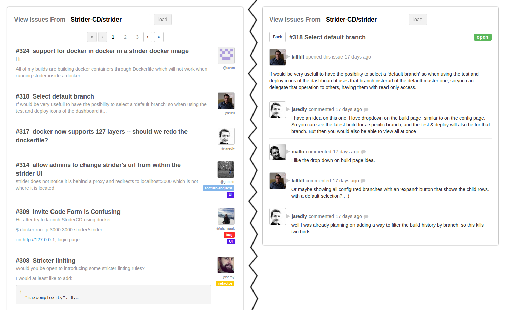

# Github issues viewer

This is a viewer of github issues that is entirely client-side. It
demonstrates one way of building a slightly-more-than-trivial app with
[facebook's React framework](http://facebook.github.io/react).

All requests to the github api are anonymous, so they cap it at 60
requests/hour.

[View the live example.](http://jaredly.github.io/github-issues-viewer)

[](http://jaredly.github.io/github-issues-viewer)

Technologies used:

- [React](http://facebook.github.io/react) for the views
- [Backbone](http://backbonejs.org) (mostly for routing... no mutable models here)
- [Bootstrap](http://twbs.github.io/bootstrap) for some styling
- [Component(1)](http://github.com/component/component) for packaging
- [LessCSS](http://lesscss.org) for css processing
- [FontAwesome](http://fontawesome.io) for icons

## Known Issues

### The Teaser

On the main page, the teaser of the issue body can break markdown sytax,
resulting in awkward-looking `` ```some code here`` or `**bold but not` at the
end of the teaser.

I thought about (and started implementing) an ad-hoc fix but then stopped,
because it was dirtly and incomplete. The real solution would be to translate
the raw text into a markdown syntax tree, and then grab the first x chunks
from there. A project for another time. I couldn't find a lib on npm to do it,
but if you know of one, please open an issue or pr.

### Anonymous API usage cap

It might be interesting to look into auth w/ github...not sure if that's
possible in a backend-less app.

### Not yet implemented things

- auto-linking to referenced issues
- auto-linking to commits, comments, etc
- probably a few other things

## Building

```
npm install -g react-tools component less
make
google-chrome web/index.html
```

## Hacking

```
npm install -g jshint mocha
make test
```

## License

Apache v2

Contribution and Comments are welcome.
